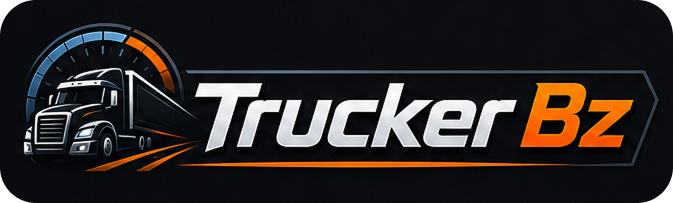

<p align="center">
  
</p>

<p align="center">
  
  
  
  
  
</p>

<p align="center">
  <strong>Live ETS2/ATS telemetry and truck controls for the Ulanzi D200.</strong>
</p>

---

## Overview

Trucker Bz turns the Ulanzi D200 into a compact truck telemetry dashboard and control panel for Euro Truck Simulator 2 and American Truck Simulator.

This repository is a public distribution package. It contains the final `com.buzs.truckerbz.ulanziPlugin` folder for store/community review, but it does not include the real TypeScript source code.

## Features

- Live telemetry buttons for speed, fuel, RPM, trip, rest and damage information.
- Truck controls for lights, beacon, wipers, windows, suspension, retarder and trailer hookup.
- Dynamic Ulanzi property inspector for per-button configuration.
- Public unpacked plugin folder for review and GitHub Release ZIPs for normal installation.

## Requirements

- Windows 10 or newer.
- Ulanzi software 2.1.4 or newer.
- Euro Truck Simulator 2 or American Truck Simulator.
- SCS telemetry SDK plugin installed in the game folder.
- `trucksim-telemetry` installed when running from a cloned repository.

## Install From Release

Download the ZIP asset from the latest GitHub Release:

```text
com.buzs.truckerbz.ulanziPlugin.zip
```

Import that ZIP in the Ulanzi software. Release ZIPs are built with runtime dependencies included, so end users do not need to run `npm install` for normal installation.

## Required SCS Telemetry Plugin

Trucker Bz reads telemetry through the Node package `trucksim-telemetry`, which depends on the SCS shared-memory telemetry plugin.

Install the SCS SDK plugin from:

```text
https://github.com/RenCloud/scs-sdk-plugin
```

Place the plugin DLL inside the `bin/win_x64/plugins/` folder of your ETS2 or ATS installation. Create the `plugins` folder if it does not exist.

Common Steam locations:

```text
C:\Program Files (x86)\Steam\steamapps\common\Euro Truck Simulator 2\bin\win_x64\plugins\
C:\Program Files (x86)\Steam\steamapps\common\American Truck Simulator\bin\win_x64\plugins\
```

When the game starts, it may show an SDK activation prompt. Accept it so telemetry becomes available.

## Running From A Clone

This public repository does not commit `node_modules`.

If you clone the repository and want to run or inspect the unpacked plugin folder directly, install runtime dependencies inside the plugin folder:

```bash
cd com.buzs.truckerbz.ulanziPlugin
npm install
```

This creates:

```text
com.buzs.truckerbz.ulanziPlugin/node_modules/trucksim-telemetry/
```

If `trucksim-telemetry` is missing from `node_modules`, the plugin runtime will not start correctly.

## Repository Layout

```text
.
├── CHANGELOG.md
├── LICENSE
├── README.md
├── assets/
└── com.buzs.truckerbz.ulanziPlugin/
    ├── manifest.json
    ├── package.json
    ├── plugin/
    ├── property-inspector/
    ├── resources/
    └── libs/
```

## License

Trucker Bz is distributed here as a built Ulanzi plugin package. The real source code is private and is not licensed as part of this public distribution.

Third-party dependencies keep their own licenses. The SCS telemetry plugin by RenCloud is available at `https://github.com/RenCloud/scs-sdk-plugin` and is licensed separately by that project.
